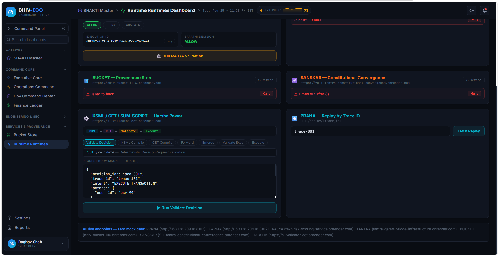

# screenshots

This directory is designated for validation and execution screenshots.

![Dark BHIV-ECC SHAKTI Master Dashboard interface with a left navigation sidebar and a main monitoring workspace. The dashboard shows 9 registered tabs, 5 of 7 live services connected, 2 blocked integrations, and pending SHAKTI API federation. Its Federated Nodes Registry lists Executive Core, Operations Command, Engineering Core, SOC Security Gateway, Finance Ledger, Analytics Node, and Gov Command Center as UI only, while Bucket Provenance Store and Runtime Services are live. Federation Engine Logs and Federated Verification Control appear on the right, with text including SHAKTI Master Dashboard, Refresh UI State, UI-level federation only, Contract Status: ACTIVE, and Verify All Signatures. The dark, organized control-room layout conveys a professional technical monitoring environment.](image.png)

