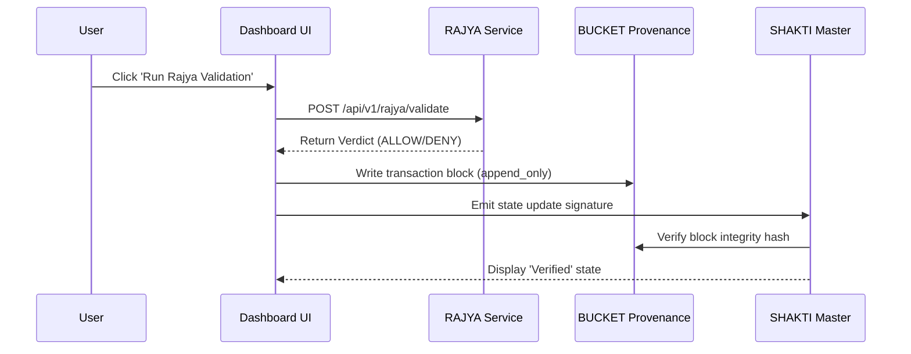

# Architecture Overview & Code Packets

This document provides a technical walkthrough of the integration registry, flow controls, and runtime contracts.

## 1. Runtime Flow Control

The application flow diagram shows the cycle from client interaction to blockchain/provenance state commitment.

## 2. Event Emitters & Registry

Sub-dashboards emit their operational payload to the SHAKTI federation engine using state triggers. When a user runs a sync task, the engine matches the dashboard's internal cryptographic hash with the latest signature recorded on the BUCKET chain.

## 3. Dependency Graph

*   `main.jsx` -> mounts `BHIVDashboardKit`
*   `BHIVDashboardKit` -> imports and renders `BucketWidget` and `RuntimeServicesWidget`
*   `BucketWidget` -> communicates with `https://bhiv-bucket-i1l6.onrender.com`
*   `RuntimeServicesWidget` -> communicates with PRANA, KARMA, RAJYA, TANTRA, BUCKET, SANSKAR, and HARSHA runtimes.
