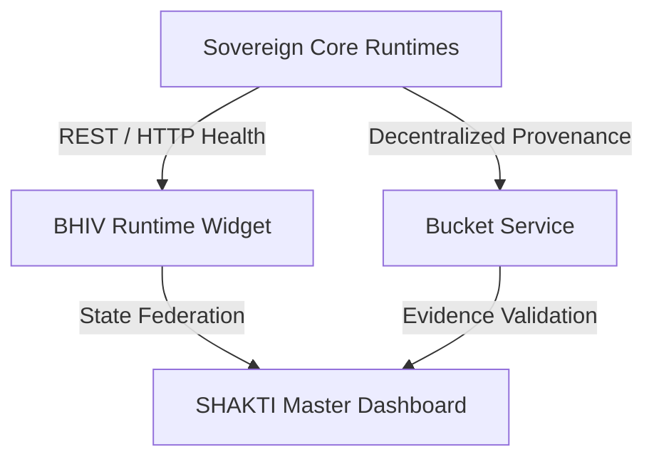

# BHIV Dashboard Kit Integration Guide

This guide outlines the integration architecture and guidelines for connecting live service runtimes to the BHIV-ECC Dashboard Kit and federating them into the SHAKTI Master Dashboard.

## 1. Overview of Integration Flow

The BHIV Dashboard Kit integrates distributed Sovereign Core runtimes using standard REST and WebSocket protocols, validating transaction integrity via the BUCKET provenance store.



## 2. Federation Registry Participation

To participate in the SHAKTI Master Dashboard federation, each widget/dashboard page must:
1. Adhere to the **Deterministic State Contract** (reporting node status, execution delay, and integrity hash).
2. Report transaction records to the **Bucket Provenance Store** for independent verification.
3. Expose telemetry traces through **InsightFlow**-compatible response headers.

## 3. Step-by-Step Integration

### Step 3.1: Runtime Discovery
Identify the live base URL for your service. The core services are mapped as follows:
*   **PRANA (Event Forwarding):** `http://163.128.209.18:8103` (Owner: Rukayya Ansari)
*   **KARMA (Integrity Chain):** `http://163.128.209.18:8102` (Owner: Rukayya Ansari)
*   **RAJYA (Governance Gate):** `https://text-risk-scoring-service.onrender.com` (Owner: Rajaryan Verma / Raj Prajapati)
*   **TANTRA (Gated Bridge):** `https://tantra-gated-bridge-infrastructure.onrender.com` (Owner: Ranjit Patil)
*   **BUCKET (Provenance Store):** `https://bhiv-bucket-i1l6.onrender.com` (Owner: Siddhesh Narkar)
*   **SANSKAR (Constitutional Convergence):** `https://full-tantra-constitutional-convergence.onrender.com` (Owner: Sakshi)
*   **HARSHA (Reserved):** Setup `URL_HARSHA` in `runtime-services-widget.jsx` once available (Owner: Harsha Pawar)

### Step 3.2: Connecting Dashboard Components
Replace synthetic mock updates with `apiFetch` or `apiPost` methods to pull data dynamically from the service registry:
```javascript
const fetchHealth = async () => {
  const data = await apiGet(SERVICE_BASE_URL, "/health");
  setHealth(data.status === "OK");
};
```

### Step 3.3: Visualizing Observability Traces
Verify telemetry logs using the Replay mechanism in `RuntimeServicesWidget`. Traces can be queried and replayed using execution IDs stored in the Bucket.

---
**Contacts for Integration Support:**
*   **Pratik:** SHAKTI Master Dashboard Federation
*   **Karan:** Integration Sessions Coordinator
*   **Vinayak Tiwari:** Final Production Certification
